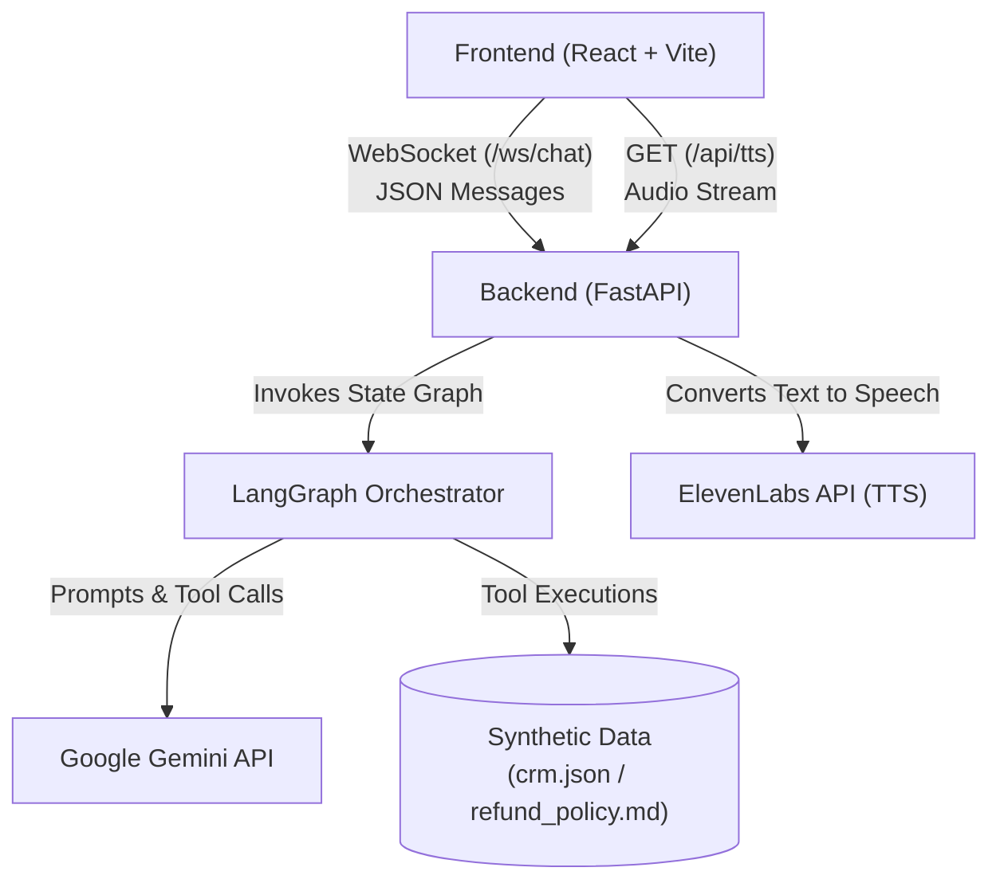
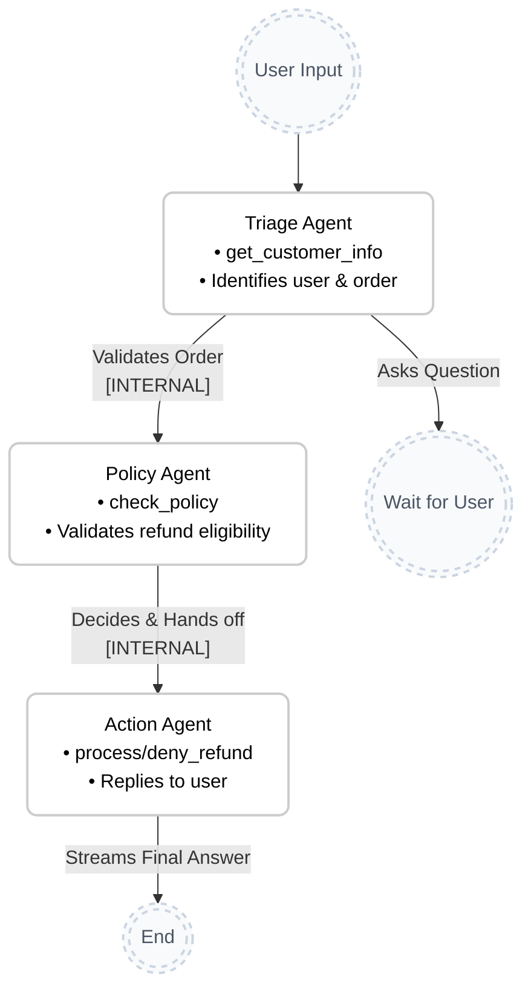
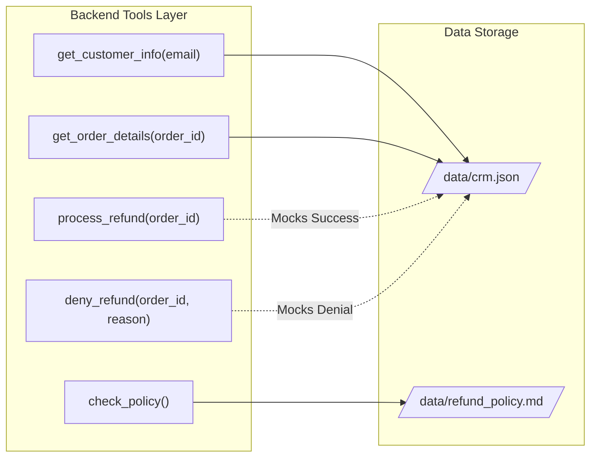

# AI Customer Support Agent: Architecture & Logic

This document details the structure and underlying logic of the AI Customer Support Agent, visualizing the system with Mermaid diagrams.

## 1. High-Level System Architecture

The application is split into a React frontend and a Python backend. It uses WebSockets for real-time text streaming and a REST endpoint for native audio streaming via ElevenLabs.

> [!NOTE]
> WebSockets are crucial here for the chat interface. Unlike a standard REST API, WebSockets allow the FastAPI server to actively stream events (like `on_tool_start`, `on_chat_model_stream`) back to the frontend in real-time. For the voice output, a direct `GET` request is used so the browser can natively stream the MP3 chunks from ElevenLabs with near-zero latency.

---

## 2. Multi-Agent Orchestration (Sequential Pipeline)

The core intelligence of the backend relies on **LangGraph**. Initially, the system used a Supervisor LLM router, but this was refactored into a **deterministic, sequential pipeline** to completely eliminate LLM routing hallucinations, prevent infinite loops, and double the execution speed.

The graph strictly routes the user's input through specialized worker agents in a predefined order.

### Routing Logic
1. A user sends a message, and it **always** routes first to the `Triage` agent.
2. The `Triage` agent evaluates the request. If it needs more info (like a Customer ID), it asks the user directly, and the graph terminates (Wait for User).
3. If `Triage` successfully validates an order for refund processing, it generates a silent `[INTERNAL]` success message.
4. Python code detects this internal tag and **deterministically** routes the flow to the `Policy` agent.
5. `Policy` evaluates the rules, logs its decision with another `[INTERNAL]` tag, and deterministically routes to the `Action` agent.
6. The `Action` agent translates the decision into a friendly response, executes the refund tools, streams the final answer to the user, and the graph concludes.

---

## 3. Data & Utility Flow

The agents rely on mock Python tools to interface with the database.

> [!TIP]
> This modular structure makes it incredibly easy to replace the synthetic JSON database with a real SQL database (e.g., PostgreSQL) or an actual headless CRM (e.g., Salesforce) in the future without changing the agent logic.
